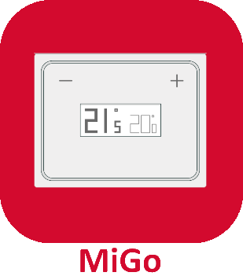

# MigoThermostat - Plugin pour Jeedom

* Intégration du Thermostat [MigoThermostat.](https://limad.github.io/plugin-migoThermostat/fr_FR/#tocAnchor-1-3).
* Topic dedié du Thermostat [MigoThermostat.](https://www.jeedom.com/forum/viewtopic.php?p=764669#p764669)
* [Documentation](index.md)*

# Changelog
>*Liste non-exhaustive. Les changements mineurs et/ou correction de bugs ne figurent pas forcément ici.*

### 06/09/2019
* Création de la version Stable Jeedom V4
* Passage de la beta sur Jeedom V4

>   *Pour Jeedom V3, rester dorénavant en version Stable. Le market sélectionne automatique la stable V3 ou V4 en fonction de votre version de Jeedom.*

